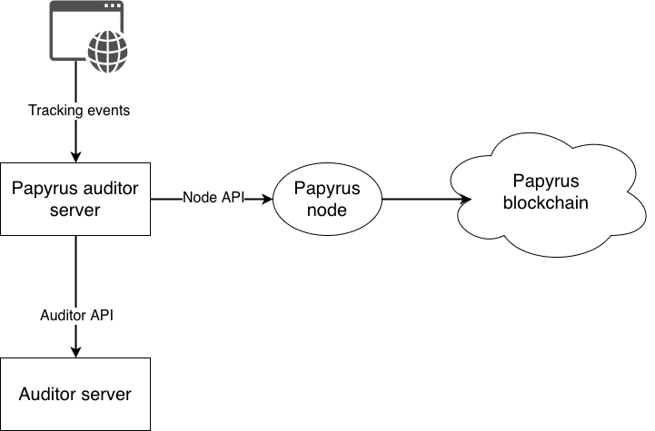
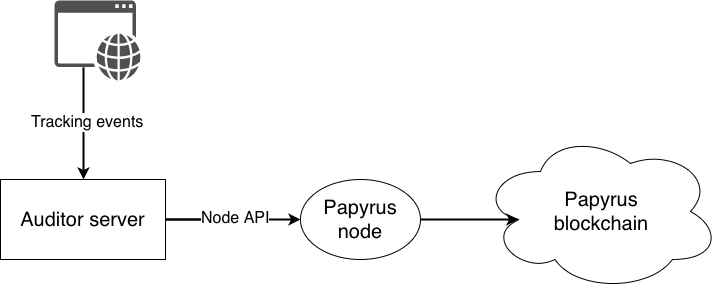
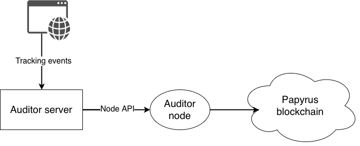

.. _auditor:

Auditor integration
===================

Auditor integration is the major feature of the Papyrus ecosystem. It enables to make payments only on real impressions and other events.

There are several ways of auditor integrations.

1. Papyrus deploys log server with its own blockchain node and connects to auditor through API.
2. Papyrus installs the node and auditor sends logs to this node.
3. Auditor installs its own node.

Papyrus log server and Papyrus node
-----------------------------------

This is the easiest way to connect auditor to Papyrus ecosyste, because Papyrus development team setup and maintain this integration on their side.

But in this case auditor has to provide an API to check requests.

API can vary for different vendors, but it must support at least the following parameters:

* request type
* user IP
* user agent
* page URL
* campaign ID

Auditor log server and Papyrus node
-----------------------------------

This case has medium difficulty for auditor. It requires that auditor process events itself and works with blockchain node, but blockchain node is maintained by Papyrus team.

Papyrus blockchain node has gRPC API with the following message structure

.. code-block:: java

	// Main channel interface
	service StateChannel {
	    // Creates or updates outgoing channel with given participant
	    rpc RegisterTransaction(RegisterTransactionRequest) returns (RegisterTransactionResponse);
	}
	 
	// Registers transaction
	message RegisterTransactionRequest {
	    // sender address in HEX
	    string sender = 1;
	    // channel contract address in HEX
	    string channel = 2;
	    // block_number
	    int64 block = 3;
	    // encoded message
	    bytes data = 4;
	    // EC signature by sender's key
	    bytes signature = 5;
	}
	 
	message RegisterTransactionResponse {
	}

	message PapyrusAuditorFeedback {
	    string imp_id = 1;
	    bool flags = 3;
	    enum Flags {
	        EMPTY=0;
	        FRAUD=1;
	        VIEW=2;
	        CLICK=4;
	    }
	}

Auditor log server and node
---------------------------

This case is the most diffucult for auditor, but it is the most effective solution. Auditor has to setup its own blockchain node and send logs to its API as in the previous case.

The Papyrus node is distibuted as docker container. We will describe installation guide soon.

