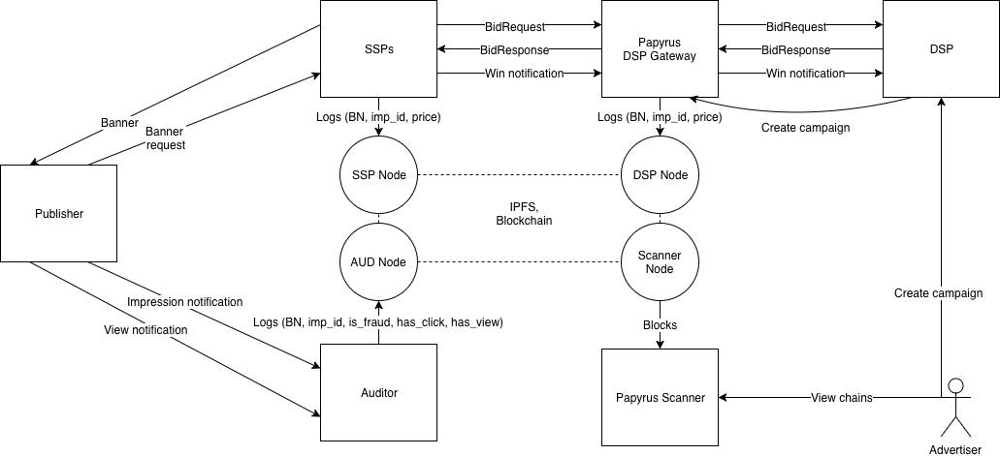
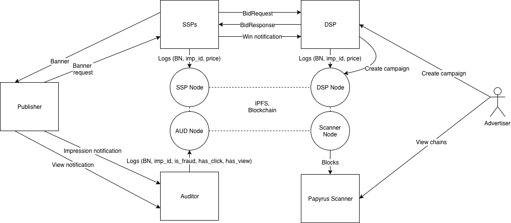

.. _dsp:

DSP integration
===============

DSP is the key participant in the ecosystem because DSP is in charge of creating ad campaign smart contracts

There are 3 ways of DSP integrations.

1. Papyrus deploys DSP gateway with its own blockchain node and DSP connects to this gateway through API.
2. Papyrus installs the node and DSP sends logs to this node. Also DSP has to create smart contracts through this node.
3. DSP installs its own node and communicates with it internally.

Papyrus DSP gateway
-------------------

To make integration easier Papyrus team can deploy DSP gateway to include DSP into Papyrus ecosystem. This gateway acts like any additional SSP, but actually it does all necessary job necessary for blockchain working and resends messages to connected SSPs and in other way.

Integration of DSP gateway differs from SSP integration in 2 points:

1. DSP has to create smart contract in Papyrus blockchain for every ad campaign.
2. DSP has to generate block number for every impression it put bid on.

DSP gateway provides an API method to creae smart contracts. 

..  http:post:: /campaigns

    Creates a smart contract for campaign.

    **Request example**

    .. sourcecode:: http

        POST /api/v1/campaigns HTTP/1.1
        Host: scanner.papyrus.global
        Accept: application/json
        Content-type: application/json

        {
        	"name": "Campaign name"
            "advertiser_id": "0a526a90a85596dcb3669fd86963422969edbbf7c4752492d780b78e6355d4ee",
            "start_date": "2018-01-01",
            "end_date": "2018-01-31",
            "budget": "10000000000",
            "maximum_cpm": "10000000",
            "ssps": [
              {
                "id": "007d831ea2e8e1d080b31e33c50b89ea07f9b694bccad998c8cf5cb1a087f889",
                "fee_percent": "0.1"
              }
            ]
            "auditors": [
              {
                "id": "c5a62ce3fa7f6d86af0009389ccd815277691ea64da0c5c98e302bb13dd59248",
                "fee_percent": "0.05"
              }
            ]
        }

    **Response example**:

    .. sourcecode:: http

        HTTP/1.1 200 OK
        Content-Type: application/json

        [
          {
            "id": "2cf24dba5fb0a30e26e83b2ac5b9e29e1b161e5c1fa7425e73043362938b9824"
          }
        ]

Advertisers, SSP and Aufitor IDs will be provided by decentralized registry in the future, now this registry is provided by Papyrus team and should be saved locally.

The result ID is the smart contract ID and should be saved for the further usage.

The contract ID is used in block generation.

  block_number = current_timestamp + '_' + contract_id

A new block number should be generated for the contract every hour. This time window can be smaller in case of big number of messages in block.

Generated block number has to be included in `ext.blocknumber` field of Bid object.

Papyrus node
------------

This case is similar to previous, but doesn't require DSP gateway. Papyrus team just deploys Papyrus blockchain node and DSP sends log records into this node through gRPC.

DSP has to send log message right after receiveing Win Notification. The format of gRPC message is presented below.

.. code-block:: java

	// Main channel interface
	service StateChannel {
	    // Creates or updates outgoing channel with given participant
	    rpc RegisterTransaction(RegisterTransactionRequest) returns (RegisterTransactionResponse);
	}
	 
	// Registers transaction
	message RegisterTransactionRequest {
	    // sender address in HEX
	    string sender = 1;
	    // block_number
	    int64 block = 3;
	    // encoded message
	    bytes data = 4;
	    // EC signature by sender's key
	    bytes signature = 5;
	}
	 
	 
	message PapyrusWinNotification {
	    string imp_id = 1;
	    // price in token * 10^18
	    int64 price = 2;
	}

Also, DSP has to create smart contract using the node API. This API will be specified later.

DSP node
--------

This case is similar to previous, but in this case DSP installs its own blockchain node. Papyrus team distibutes blockchain nodes as docker images with instruction provided. The link to the distro will be published later.