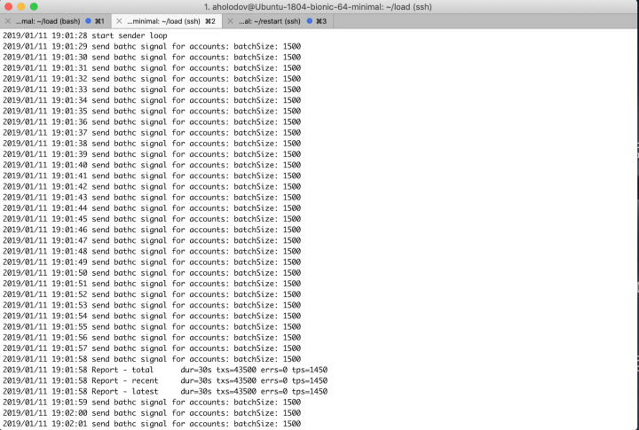
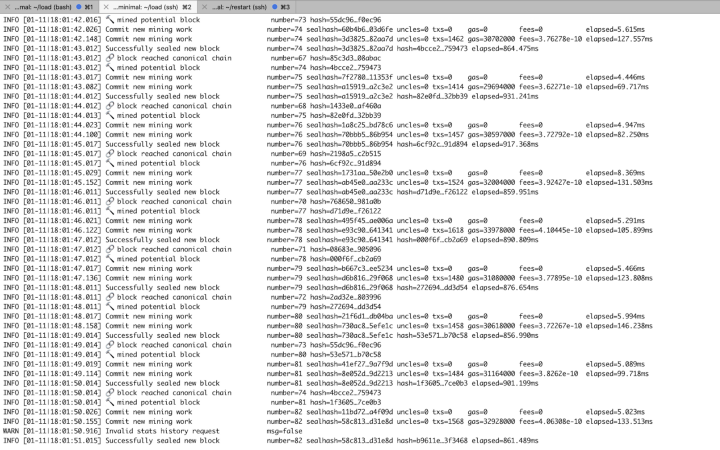
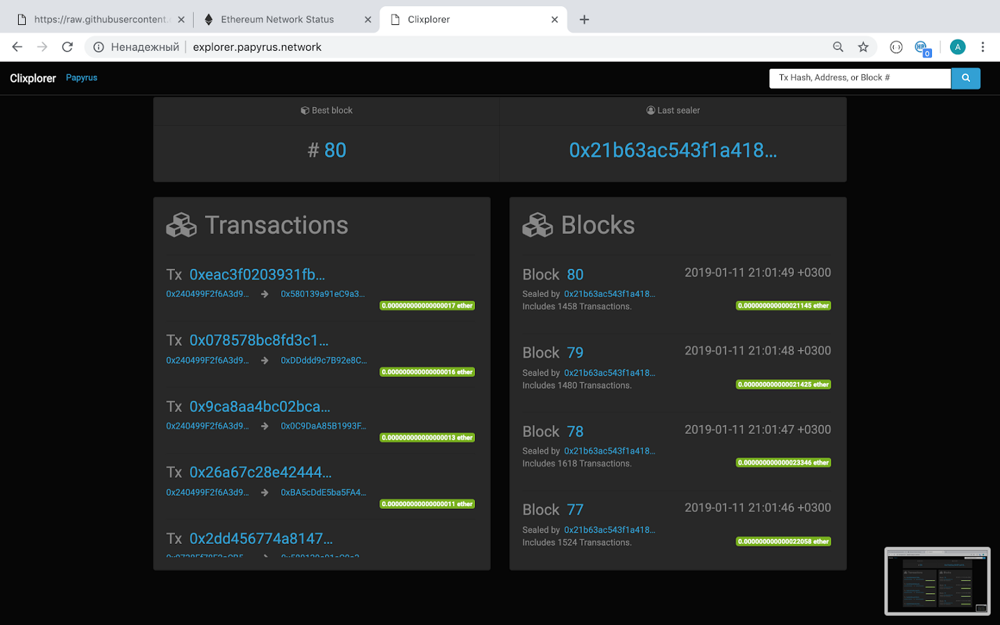

Network Performance
===================

Papyrus network designed as high loaded solution that should be able to process more than 1000 tps.
To achieve these performance results we completely changed most of ethereum transaction constants.

Results of this tuning you may see below:

*  ``peer.go`` class that contains constants that are responsible for queue sizes.

.. code-block:: javascript
      :emphasize-lines: 4,9,14 
      
            // maxQueuedTxs is the maximum number of transaction lists to queue up before
            // dropping broadcasts. This is a sensitive number as a transaction list might
            // contain a single transaction, or thousands.
            maxQueuedTxs = /*128*/ 16384

            // maxQueuedProps is the maximum number of block propagations to queue up before
            // dropping broadcasts. There's not much point in queueing stale blocks, so a few
            // that might cover uncles should be enough.
            maxQueuedProps = /*4*/ 32

            // maxQueuedAnns is the maximum number of block announcements to queue up before
            // dropping broadcasts. Similarly to block propagations, there's no point to queue
            // above some healthy uncle limit, so use that.
            maxQueuedAnns = /*4*/ 32
            
            handshakeTimeout = 5 * time.Second
      ) 
      
Next step was in increasing up to ten times size of transaction chain. For that reason few more classes were tuned by changing its constant values

*  ``sync.go`` 

.. code-block:: javascript
      :emphasize-lines: 3 
      
            // This is the target size for the packs of transactions sent by txsyncLoop.
            // A pack can get larger than this if a single transactions exceeds this size.
            txsyncPackSize = /*100 * 1024*/ 1000 * 1024

*  ``ethstats.go`` 

.. code-block:: javascript
      :emphasize-lines: 4,9,14 
      
            // The number is referenced from the size of tx pool.
            txChanSize = 4096
            // chainHeadChanSize is the size of channel listening to ChainHeadEvent.
            chainHeadChanSize = /*10*/ 100

*  ``server.go`` 

.. code-block:: javascript
      :emphasize-lines: 3 
      
            func (pm *ProtocolManager) blockLoop() {
                  pm.wg.Add(1)
                  headCh := make(chan core.ChainHeadEvent, /*10/* 100)
                  headSub := pm.blockchain.SubscribeChainHeadEvent(headCh)

*  ``worker.go`` 
.. code-block:: javascript
      :emphasize-lines: 4 
      
      	txChanSize = 4096

            // chainHeadChanSize is the size of channel listening to ChainHeadEvent.
            chainHeadChanSize = /*10*/ 100

            // chainSideChanSize is the size of channel listening to ChainSideEvent.
            chainSideChanSize = 10

*  ``tx_pool.go`` class that contains most of logic for the transaction pool:

.. code-block:: javascript
      :linenos:
      :emphasize-lines: 3,10,11,12,13

        const (
            // chainHeadChanSize is the size of channel listening to ChainHeadEvent.
            chainHeadChanSize =  /*10*/ 100
        )
        ...
        DefaultTxPoolConfig = TxPoolConfig{
            PriceLimit: 1,
            PriceBump:  10,

            AccountSlots: /*16*/ 8192,
            GlobalSlots:  /*4096*/ 131072,
            AccountQueue: /*64*/ 4096,
            GlobalQueue:  /*1024*/ 32768,
        } 

After that we added transaction batching and overhauled buffers.
This kind of transaction packaging lets us to drastically increase network performance without compromising security. 
In order to unlock the full potential of this approach, we also had to rework the queue sizes for pending and queued transactions.
While these changes implied new changes in parameters of the maximum number of permissible transactions, and, most importantly, 
in the total number of transactions.

*  ``tx_pool.go``

.. code-block:: javascript

            // feedLoop continuously sends batches of txs from the txFeedBuf to the txFeed.
            func (pool *TxPool) feedLoop() {
                  defer pool.wg.Done()

                  const batchSize = 1000
                  for {
                        select {
                        case <-pool.chainHeadSub.Err():
                              return
                        case tx := <-pool.txFeedBuf:
                              var event NewTxsEvent
                              event.Txs = append(event.Txs, tx)
                              for i := 1; i < batchSize; i++ {
                                    select {
                                    case tx := <-pool.txFeedBuf:
                                          event.Txs = append(event.Txs, tx)
                                    default:
                                          break
                                    }
                              }
                              pool.txFeed.Send(event)
                        }
                  }
            }

            // feedSend queues tx to eventually be sent on the txFeed.
            func (pool *TxPool) feedSend(tx *types.Transaction) {
                  select {
                  case pool.txFeedBuf <- tx:
                        return
                  default:
                        go func() { pool.txFeedBuf <- tx }()
                  }
            }

The result is a tenfold increase in performance. For multiple tests, we used a specific utility to load the network with 1500 transactions every second.
The test results showed that the network successfully handles 1500 transactions per second and works stably at such a load for a long period of time.
Below you can find the logs of the utility and the logs of the node.
The logs show that all 1500 transactions fall into a block, which is generated every second. During the test, we used the type of configuration, suggesting the entire load to be applied to one gateway node, while the gateway-node is not engaged in the generation of blocks.
Blocks are generated by several sealer nodes.

Results
-------

Utility logs:

Node logs:

A visual representation, which can be seen on our monitor explorer (screenshot):

The test shows, that 1500 transactions fall into a block every second it is generated.

As a result, we got the desired and unique combination of a quality network.
