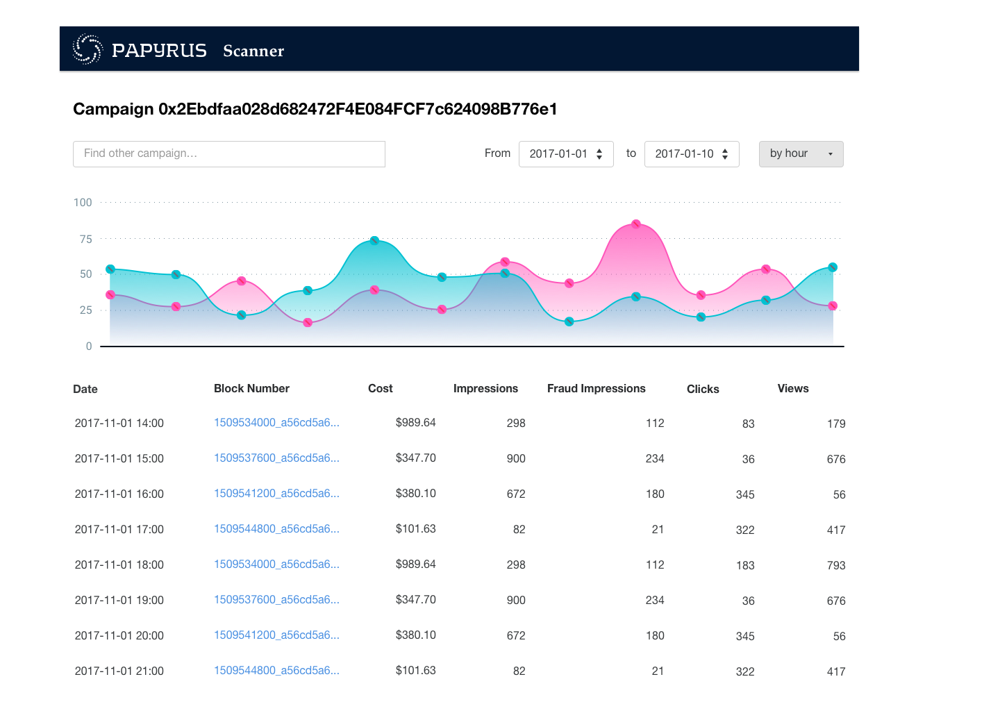

.. _scanner:

Papyrus scanner
===============

General
-------

Papyrus scanner is a software solution to view Papyrus blockchain.
It enables to any participant (advertisers, publishers, vendors) to see ad campaigns they pariticpate into.

Papyrus scanner provides information about ad campaign smart contracts and aggregates validated statistics information.
The scanner shows aggregated statistics blocks where you can find

* actual cost paid to SSP and other vendors;
* amount of fraud impressions;
* actual clicks and views count.

For example, you can see that there were 1,975 impressions, but in fact only 1,545 were real not fraud ones. And you can view real clicks count and impressions. More important that you paid only for these real impressions.

The agency fee and other vendor fees are included in reporting according to the campaign contract, so you can be sure that there are no opaque markups.

Scanner API
-----------

Read campaign list
^^^^^^^^^^^^^^^^^^

..  http:get:: /campaigns

    Returns a list of campaigns.

    **Request example**

    .. sourcecode:: http

        GET /api/v1/campaigns HTTP/1.1
        Host: scanner.papyrus.global
        Accept: application/json

    **Response example**:

    .. sourcecode:: http

        HTTP/1.1 200 OK
        Content-Type: application/json

        [
          {
            "id": "2cf24dba5fb0a30e26e83b2ac5b9e29e1b161e5c1fa7425e73043362938b9824",
            "name": "Campaign name"
            "advertiser_id": "0a526a90a85596dcb3669fd86963422969edbbf7c4752492d780b78e6355d4ee",
            "start_date": "2018-01-01",
            "end_date": "2018-01-31",
            "budget": "10000000000",
            "maximum_cpm": "10000000",
            "ssps": [
              {
                "id": "007d831ea2e8e1d080b31e33c50b89ea07f9b694bccad998c8cf5cb1a087f889",
                "fee_percent": "0.1"
              }
            ]
            "auditors": [
              {
                "id": "c5a62ce3fa7f6d86af0009389ccd815277691ea64da0c5c98e302bb13dd59248",
                "fee_percent": "0.05"
              }
            ]
          }
        ]

    :query String key: participant_key, required
    :query String campaign_id: campaign filter
    :query String advertiser_id: advertiser filter
    :query String dsp_id: dsp filter
    :query String ssp_id: ssp filter
    :query String auditor_id: auditor filter

Read campaign statistics
^^^^^^^^^^^^^^^^^^^^^^^^

..  http:get:: /statistics

    Returns campaign statistics.

    **Request example**

    .. sourcecode:: http

        GET /api/v1/statistics?campaign_id=2cf24dba5fb0a30e26e83b2ac5b9e29e1b161e5c1fa7425e73043362938b9824 HTTP/1.1
        Host: scanner.papyrus.global
        Accept: application/json

    **Response example**:

    .. sourcecode:: http

        HTTP/1.1 200 OK
        Content-Type: text/javascript

        [
          {
            "date": "2017-12-12",
            "block_number": "1511718000_496aca80e4d8f29fb8e8cd816c3afb48d3f103970b3a2ee1600c08ca67326dee"
            "cost": "12340000",
            "impressions": "1234",
            "fraud_impressions": "321",
            "clicks": "56",
            "views": "77",
            "ssps": [
               {
                 "id": "007d831ea2e8e1d080b31e33c50b89ea07f9b694bccad998c8cf5cb1a087f889",
                 "fee": "1234000"
               }
            ]
            "auditors": [
               {
                 "id": "c5a62ce3fa7f6d86af0009389ccd815277691ea64da0c5c98e302bb13dd59248",
                 "fee": "617000"
               }
            ]
          },
          {
            "date": "2017-12-12",
            "block_number": "1511723000_6d0b07ee773591f2a1b492d3ca65afdefc90e1cadfcc542a74048bb0ae7daa27"
            "cost": "43210000",
            "impressions": "4321",
            "fraud_impressions": "789",
            "clicks": "123",
            "views": "135",
            "ssps": [
               {
                 "id": "007d831ea2e8e1d080b31e33c50b89ea07f9b694bccad998c8cf5cb1a087f889",
                 "fee": "4321000"
               }
            ]
            "auditors": [
               {
                 "id": "c5a62ce3fa7f6d86af0009389ccd815277691ea64da0c5c98e302bb13dd59248",
                 "fee": "2160500"
               }
            ]
          }
        ]

    :query key: participant_key, required
    :query campaign_id: campaign filter, required
    :query date_from: date filter
    :query date_to: date filter

