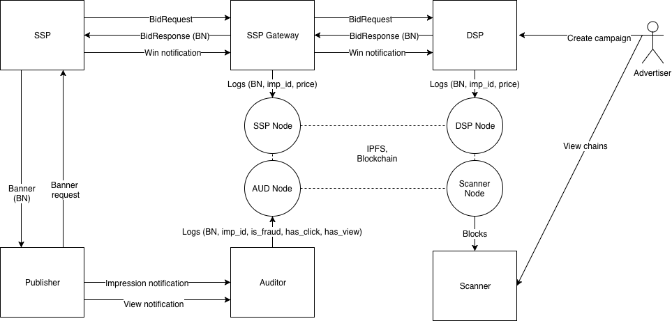
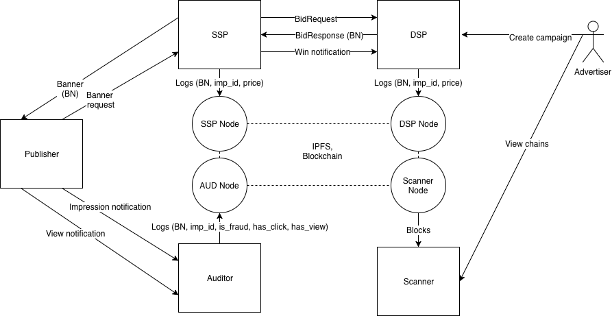

.. _ssp:

SSP integration
===============

The most easiest participant for an integration into the Papyrus ecosystem is SSP.

There are 3 ways of SSP integrations.

1. Papyrus deploys SSP gateway with its own blockchain node and SSP connects to this gateway through API.
2. Papyrus installs the node and SSP sends logs to this node.
3. SSP installs its own node and communicates with it internally.

Papyrus SSP gateway
-------------------

For basic integration Papyrus can deploy SSP gateway by its own team. In this case SSP can connect SSP gateway like any other DSP.

SSP gateway is the system which passes Bid Requests and Win Notifications from integrated SSP to connected DSPs. SSP just sends all requests to SSP gateway instead of DSP and gateway does all necessary job to put log records into decentralized storage. The auction is holded by SSP itself and gateway just records the winner record. SSP Gateway has to send log record to Channel Node after receiving Win Notification. The record contains block number, impression_id and the winning price.

Papyrus node
------------

This case is similar to previous, but doesn't require SSP gateway. Papyrus team just deploys Papyrus blockchain node and SSP sends log records into this node through gRPC.

The main difficulty that SSP has get block number from Bid Response. This block number is written in `ext.blocknumber` field of Bid object.

SSP has to send message on Win Notification generation. The format of gRPC message is presented below.

.. code-block:: java

	// Main channel interface
	service StateChannel {
	    // Creates or updates outgoing channel with given participant
	    rpc RegisterTransaction(RegisterTransactionRequest) returns (RegisterTransactionResponse);
	}
	 
	// Registers transaction
	message RegisterTransactionRequest {
	    // sender address in HEX, from config
	    string sender = 1;
	    // block_number, from Bid Response
	    int64 block = 3;
	    // encoded message, format below
	    bytes data = 4;
	    // EC signature by sender's key, from congif
	    bytes signature = 5;
	}
	 
	 
	message PapyrusWinNotification {
	    string imp_id = 1;
	    // price in token * 10^18
	    int64 price = 2;
	}

SSP node
--------

This case is similar to previous, but in this case SSP has to install its own blockchain node. Papyrus team distibutes SSP node as docker image with instruction provided. The link to the distro will be published later.

