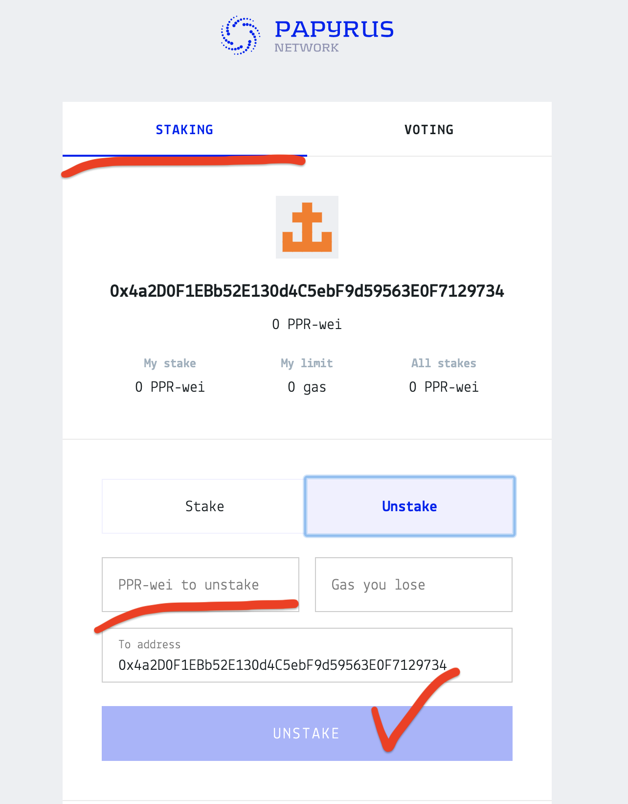

Staking
================

**Why we implemented token staking in Papyrus Network?**

Token staking is the method to allocate network bandwidth to specific user or application developer needs. We use idea of toknisation to manage network resources and avoid network flood and sybil attacks on the network. 

There is a fixed amount of network bandwidth tokens issued at every point in time (every block formed in the network). 
Imagine that to get right to use X% of network bandwidth you have to freeze X% of issued tokens, making them unavailable to transfers and any other usage. You can always unfreeze them by requesting that, but you will have to wait 3 days and will lose ability to use X% of network bandwidth. That is the simple illustration, how network bandwidth may be tokenised with fixed amount of tokens. 

In Papyrus Network native token is called PPR and it is used for network bandwidth tokenisation. Rules around token staking/unstaking and resource allocation are slightly more complex in the real Papyrus Network and are described below.
Also Papyrus Network supports delegation of allocated bandwidth, meaning that application developer can make own stake to allocate network bandwidth for his application and then allow to use it for free for their smart contract users. 

If existing stake provides bandwidth, that is not enough to run required transactions for the user or smart contract, it will result in transaction failure. Still transaction can be retried again, as bandwidth allocation for the stake becomes refilled with the time. Application developers and users should plan their bandwidth allocation in advance and increase/decrease their stakes as necessary. 

Ultimately stake-based resource management allows application developers to plan network resources cost in advance and build reliable business models for their dApps. As an example, dApp developer could charge users off-chain (via Google Play or Apple App Store) and put them into on-chain whitelist to execute smart contract functions for free using developer's stake, thus significantly simplifying their onboarding to dApp.

How to stake tokens
-------------------

The easyest way to stake/unstake tokens is to `use Papyrus Wallet. <https://docs.papyrus.network/en/latest/doc/tools.html>`_
Papyrus Wallet works with MetaMask extension and gives you a particularly user-friendly interface for all features of Papyrus Network. 
To stake your tokens just chose staking tab and then fill the fields with stakes or gaslimit and press Stakes button. 
By default - stake will be processed onto your address. To stake on smartcontract - just fill its address to the field and push stake button! Remember that only one stake is available to the one smartcontract. 
Main Papyrus Wallet inteface you could see on the screenshot: 

You can easily unstake your tokens, just go to the Unstake tab and enter value for unstaking.
When unstaking is done your tokens are frozen and you have to wait for some time to process with withdraw. 

Code Examples
-------------

Examples - how to use stakes in your DApp  `you could find in the API section <https://papyrus-network.readthedocs.io/en/latest/doc/api/api-staking.html>`_

