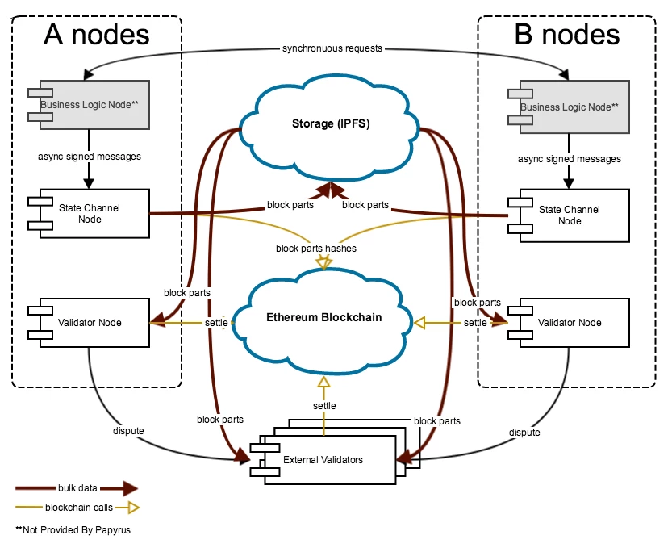
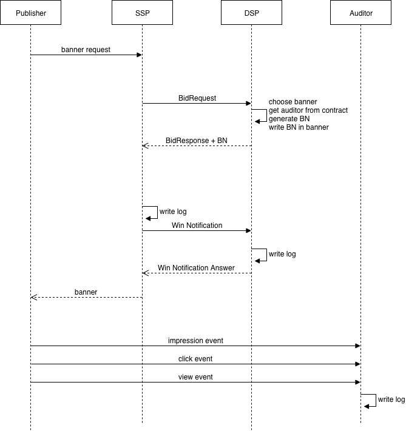

Technology overview
===================

Basic concept
-------------

The base of Papyrus technology is the scalability layer. This layer allows processing large amount of data while keeping blockchain guarantees. Papyrus uses map-reduce approach to aggregate data into compact lists of output transactions which are posted to blockchain. This is somehow similar to plasma.io approach. But our solution is much simplier because we do not try to build public universal blockchain.

The scalability layer is combination of: 

* Channel nodes.
* Distributed offchain storage.
* Validator nodes (functionality will be implemented as part of channel nodes).
* Base chain: in prototype - ethereum blockchain. In production mode - consortium blockchain shared among ecosystem participants (like https://github.com/tendermint/ethermint or bitshares).
* Token exchange protocol between base chains and public chains like Ethereum or Bitcoin (two-way peg).

Papyrus node
------------

Papyrus node is a complete set of required software for blockchain and IPFS communication. It consists of business logic, state channel and validator nodes.

Channel blocks
--------------

State channel's message log may contain thousands messages per second and needs to be compacted before settling to base blockchain. For this reason messages in each state channel are grouped into blocks. Block may have thousands of messages. So we have hierarchy: base chain→state channel→block→message. We update base chain on per-block basis so blockchain interaction is limited. Only block headers go to base chain. Block data is stored in offchain block storage for some period.

Messages which need to be processed together (e.g. messages for same impressionId) must get same block number. Participants must negotiate in advance over how block numbers are generated. For example SSP may generate block number incremented every hour and pass it to other participants during RTB. Each message must include signature, target channel id and block number.

Lifecycle of each channel block has following stages:

* Collection. Each participant produce messages and sends it to his channel node. Channel node temporarily stores messages in apache kafka for persistence. Collation. When collection period is finished (no new messages may be added to the block) each participant:

  * gathers all block messages single blob - "block part" (block part is different for each participant, so each block may have up to N block parts, where N - is number of participants);
  * writes block part to block storage;
  * computes hash of block part and store to base chain.

* Processing. After each participant have posted his block part, all block parts are merged and processed by validators. As a result of processing validators generate block output. This part is described in Validators.

* Settlement. Block output transactions are settled to blockchain.

Notes:

* Different blocks are processed independently. Processing of next block may be completed earlier than previous. To ensure that all participants have enough time to write their data there is a timeout before block is considered final. It must accont for all possible delays like * verifying impressions by auditor.
* To avoid DoS attacks there are limits on number of messages in block and each message size.
* Data written to block storage is encrypted by key known only to channel participants.
* Participants may include in their block parts as messages created by them and also messages created by other participants. In other words participants should include messages they are incentivised to store and skip other messages, i.e. messages that being excluded make participant risk losing money.

Validators
----------

Block data processing is performed offchain by validator nodes. Validation algorithm is deterministic so each non-faulty validator given same input data must return same result. 
To make validation process scalable Papyrus uses few validator nodes for each block. 
Validator nodes act by request from participants. To process block they need to download all block parts from storage merge block parts - duplicate messages are removed and messages are sorted deterministically process result block data using specific algorithm which also may use data from state channel contract as a result of processing list of output transactions is constructed

Block processing has following steps:

* Each participant choose which validators it will delegate block validation and send them signed request containing channel id and block number and block encryption key. Validators use provided information to process block data and post hashed result to blockchain.
* If all choosen validators got same result (normal situation) then processing completes.
* If at least two validators have returned different results then block challenge period is extended and dispute process used to resolve conflicts.

Participants may use different strategies for choosing validators:

* By running trusted validator node. Install trusted validator node on their own servers and use it for each new block.
* By running coordinator node which select external validators. One or several randomly choosen validators are used for each new block. Participant still need run coordinator node to choose and communicate with validators.
* In normal situation number of validators is equal to number of participants. But in case of faulty or malicious behaviour of validators dispute process is used to ensure correctness and additional validators may be used.

Event sequence
--------------

The very important part of the process is how events are recorded. In prototype ecosystem Papyrus suggests two types of records:

1. Win records. These records are generated by SSP after winner choice and by DSP after receiving win notification.
2. Auditor check records. These records are generated by auditor after receiving events from publishers.

You can see these time moments on the following sequence diagram.

